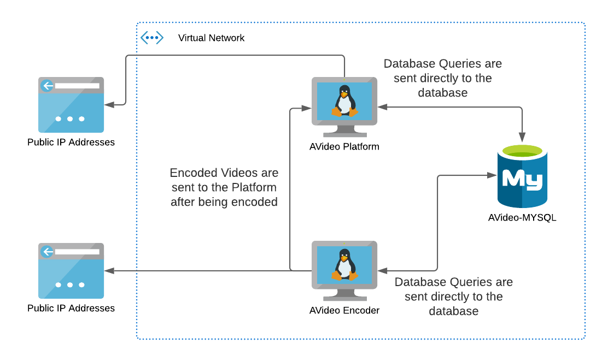

# Avideo-In-Azure

AVideo is a fork of Youtube. The goal of this project is to deploy the program in Azure.

There are two A0 Ubuntu VM with Standard HDD as well as an azure MYSQL service.

After deployment you will navigate to the public ip address of each VM and navigate to the addresses as follows:

- http://[public-ip]/AVideo 
- http://[public-ip]/AVideo-Encoder.

### Extra Deployment Instructions

From there you will go through the setup process of the site. You will need the database username and password you set during deployment as well as the full url asociated with the MYSQL service. After that the site will ask you to delete a folder on each of the VM's. This can not be autometed as the folder is required for initial setup. Because of this, the SSH port is accessable for easily connecting to the VM and removing the folders. It is advised that after the folder is removed, close the SSH port on both VM's

You must also configure the Platform to communicate with the Encoder. This is done by loging into the Platform and setting the url of the Encoder in the settings.

## Visio/Dataflow Diagram

## 5 Pillars of the Azure Well Architected Framework
1. Cost Optimization - Both VM's set to A0 providing the most cost savings. The azure mysql service is also set to the smallest environment available to increase cost savings.
2. Reliability - Because the each of the services is seperated into their own vm or azure service, this increases reliability as if one vm goes down, it doesnt take the entire site down.
3. Security - The database is only accessable to Azure Resources making it impossible for anything on the open web to access the database directly. As well as advising to close the SSH port after its use is completed.
4. Performance Efficiency - Because the each of the services is seperated into their own vm or azure service, this increases the perfomace of the individual services offered as they do not have to compete for resources.
5. Operations Excellence - Deployment of the service is automated as well as only the needed ports are open to the public internet.

## Services Used
Here is a list of all the services installed on both VM's
- apache2 
- php 
- libapache2-mod-php 
- php-mysql 
- php-curl 
- php-gd 
- php-intl 
- mysql-server 
- mysql-client 
- ffmpeg 
- git 
- libimage-exiftool-perl 
- php-mbstring 
- php-gettext 
- python

## Future Revisions
Future additions would be to add another server/storage for external storage support.

Other Future Additions would include the ability to have multiple Platforms serving making it possible to scale out instead of just up.